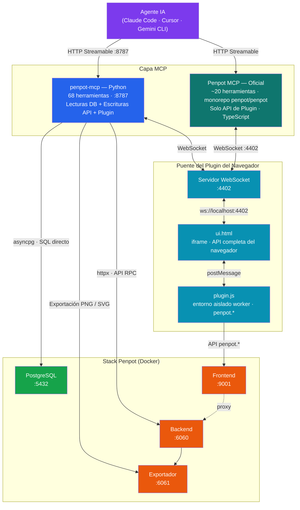

# Servidor MCP de Penpot

**Acceso a la herramienta de diseño impulsada por IA para Penpot autoalojado a través del Protocolo de Contexto de Modelo (MCP).**

[](LICENSE)
[](https://python.org)
[](https://modelcontextprotocol.io)
[](TOOLS.md)

---

## ¿Qué es esto?

Un [servidor MCP](https://modelcontextprotocol.io) que proporciona a los agentes de IA (como Claude Code, Cursor o cualquier cliente compatible con MCP) **acceso programático completo** a tu instancia de [Penpot](https://penpot.app) autoalojada. La IA puede leer, crear, modificar y exportar elementos de diseño — desde rectángulos y texto hasta componentes completos de UI — todo a través de lenguaje natural.

Piensa en ello como el puente entre tu asistente de IA y tu herramienta de diseño.

### Problemas que resuelve

| Problema | Solución |
|---|---|
| **Trabajo de diseño manual** | La IA crea componentes de UI, diseños y prototipos directamente en Penpot |
| **Sin API programática para Penpot** | 68 herramientas que cubren proyectos, formas, texto, exportaciones, comentarios y más |
| **Brecha entre diseño y código** | Genera CSS a partir de cualquier forma, exporta a SVG/PNG, extrae tokens de diseño |
| **Tareas repetitivas** | Operaciones por lotes: renombrar formas, actualizar colores, crear variantes |
| **Mantenimiento del sistema de diseño** | Leer/escribir componentes, colores y tipografías de forma programática |

---

## Arquitectura



**Estrategia de acceso de tres capas:**
- Las **lecturas** van directamente a PostgreSQL vía `asyncpg` — rápido y confiable, evita la sobrecarga de la API
- Las **escrituras** pasan por la API RPC de Penpot vía `httpx` — garantiza un seguimiento adecuado de cambios y un historial de deshacer
- Las **exportaciones** usan el exportador integrado de Penpot (Chromium sin cabeza) para una salida SVG/PNG perfecta a nivel de píxel
- El **lienzo en vivo** pasa por el puente del Plugin del navegador (puerto 4402) — arquitectura compartida con el [MCP oficial de Penpot](https://github.com/penpot/penpot/tree/develop/mcp), lo que permite que ambos servidores coexistan y se complementen en el mismo flujo de trabajo de IA

---

## Stack Tecnológico

| Componente | Tecnología | Propósito |
|---|---|---|
| Lenguaje | Python 3.13 | Entorno de ejecución |
| SDK MCP | [FastMCP](https://github.com/modelcontextprotocol/python-sdk) | Manejo de protocolo, registro de herramientas |
| Base de datos | [asyncpg](https://github.com/MagicStack/asyncpg) | Acceso directo a PostgreSQL |
| Cliente HTTP | [httpx](https://www.python-httpx.org/) | Llamadas a la API RPC de Penpot |
| Validación | [Pydantic v2](https://docs.pydantic.dev/) | Validación automática de parámetros |
| Gestor de paquetes | [uv](https://github.com/astral-sh/uv) | Gestión rápida de dependencias de Python |
| WebSocket | [websockets](https://websockets.readthedocs.io/) | Puente en tiempo real del plugin del navegador |
| Contenedor | Docker | Despliegue junto a Penpot |

---

## Inicio Rápido

### Prerrequisitos

1. **Penpot autoalojado** ejecutándose a través de Docker Compose ([guía oficial](https://help.penpot.app/technical-guide/getting-started/#install-with-docker))
2. **Docker** y **Docker Compose** v2 instalados
3. **Tokens de acceso habilitados** en tu instancia de Penpot (ver [Habilitar Tokens de Acceso](#habilitar-tokens-de-acceso))

### Opción A: Configuración Automatizada

```bash
git clone https://github.com/ancrz/penpot-mcp-server.git
cd penpot-mcp-server
chmod +x setup.sh
./setup.sh
```

El script te guiará a través de la configuración, construirá la imagen de Docker e iniciará el servidor.

### Opción B: Configuración Manual

#### 1. Clonar el repositorio

```bash
git clone https://github.com/ancrz/penpot-mcp-server.git
cd penpot-mcp-server
```

#### 2. Crear tu configuración

```bash
cp .env.example .env
```

Edita `.env` con los detalles de tu Penpot:

```env
# Tu token de acceso de Penpot (ver "Habilitar Tokens de Acceso" abajo)
PENPOT_ACCESS_TOKEN=your-token-here

# La contraseña de la base de datos de Penpot (desde tu docker-compose.yml de Penpot)
PENPOT_DB_PASS=your-db-password

# URL pública donde accedes a Penpot en el navegador
PENPOT_PUBLIC_URL=http://localhost:9001
```

#### 3. Agregar el servicio MCP a tu stack de Docker de Penpot

Agrega la definición del servicio `penpot-mcp` a tu `docker-compose.yml` existente de Penpot. Consulta [`docker-compose.penpot.yml`](docker-compose.penpot.yml) para la definición completa del servicio para copiar.

#### 4. Construir e iniciar

```bash
docker compose up -d --build penpot-mcp
```

#### 5. Verificar que está ejecutándose

```bash
# Verificación rápida de estado
curl -s http://localhost:8787/
# → {"service": "Penpot MCP", "status": "ok", "version": "0.1.0"}
```

```bash
# Inicialización completa del protocolo MCP
curl -s http://localhost:8787/mcp \
  -H "Content-Type: application/json" \
  -d '{"jsonrpc":"2.0","id":1,"method":"initialize","params":{"protocolVersion":"2025-03-26","capabilities":{},"clientInfo":{"name":"test","version":"1.0"}}}'
```

Deberías ver una respuesta JSON con las capacidades del servidor.

---

## Conectar tu Agente de IA

Penpot MCP usa **transporte de red** (HTTP streamable) — el servidor se ejecuta como un contenedor de Docker y los clientes se conectan vía HTTP. Esto significa:

- El servidor está **siempre ejecutándose** de forma independiente (vía Docker Compose)
- El cliente solo necesita la URL para conectarse — sin lanzamiento de procesos
- **`env` en la configuración JSON del cliente es irrelevante** — las credenciales viven en el propio archivo `.env` del servidor (configurado durante la [configuración](#inicio-rápido))
- Cualquier cliente en la misma máquina (o red) puede conectarse a `http://localhost:8787/mcp`

> **Diferencia clave con servidores stdio:** Con servidores stdio (como Skill Swarm), el cliente lanza el proceso e inyecta variables de entorno. Con servidores de red como Penpot MCP, el servidor gestiona sus propias credenciales. El bloque `env` en la configuración MCP de tu cliente no tiene efecto.

---

### Claude Code

Claude Code usa `"type": "http"` para conexiones HTTP streamable.

**Global** (`~/.claude.json`):

```json
{
  "mcpServers": {
    "penpot": {
      "type": "http",
      "url": "http://localhost:8787/mcp"
    }
  }
}
```

**Nivel de proyecto** (`.mcp.json` en la raíz de tu proyecto):

```json
{
  "mcpServers": {
    "penpot": {
      "type": "http",
      "url": "http://localhost:8787/mcp"
    }
  }
}
```

Reinicia Claude Code. Deberías ver **68 herramientas** del servidor `penpot` listadas cuando ejecutes `/mcp`.

> **Nota:** Usa `"type": "http"`, no `"streamable-http"`. Claude Code mapea `http` al transporte HTTP streamable internamente. Usar `streamable-http` causará un error de validación de esquema.

---

### Gemini CLI

Gemini CLI usa `httpUrl` (no `url`) para conexiones HTTP streamable. El transporte se infiere desde el nombre del campo.

**Archivo de configuración:** `~/.gemini/settings.json`

```json
{
  "mcpServers": {
    "penpot": {
      "httpUrl": "http://localhost:8787/mcp"
    }
  }
}
```

> **Nota:** Gemini CLI distingue entre `url` (transporte SSE) y `httpUrl` (transporte HTTP streamable). Penpot MCP usa HTTP streamable, por lo tanto usa `httpUrl`. No se necesita el campo `type`.

---

### Antigravity

Antigravity usa `serverUrl` para servidores MCP basados en HTTP.

**Archivo de configuración:** `~/.gemini/antigravity/mcp_config.json`

```json
{
  "mcpServers": {
    "penpot": {
      "serverUrl": "http://localhost:8787/mcp"
    }
  }
}
```

> **Nota:** Antigravity usa `serverUrl` (no `url` ni `httpUrl`). Si Antigravity se ejecuta dentro de Docker, asegúrate de que pueda alcanzar `localhost:8787` en el host — es posible que necesites `host.docker.internal:8787` en lugar de `localhost:8787` dependiendo de tu configuración de red de Docker.

---

### Comparación Rápida

| | Claude Code | Gemini CLI | Antigravity |
|---|---|---|---|
| **Archivo de configuración** | `~/.claude.json` o `.mcp.json` | `~/.gemini/settings.json` | `~/.gemini/antigravity/mcp_config.json` |
| **Campo URL** | `"url"` | `"httpUrl"` | `"serverUrl"` |
| **Campo Tipo** | `"type": "http"` (requerido) | No necesario (inferido) | No necesario (inferido) |
| **`env` en JSON** | Sin efecto (servidor de red) | Sin efecto (servidor de red) | Sin efecto (servidor de red) |
| **Credenciales** | Archivo `.env` del servidor | Archivo `.env` del servidor | Archivo `.env` del servidor |
| **Red de Docker** | `localhost:8787` | `localhost:8787` | Puede necesitar `host.docker.internal:8787` |

---

### Ejemplos de prompts

Una vez conectado, puedes pedirle a tu agente de IA cosas como:

- *"Lista mis proyectos de Penpot"*
- *"Crea un formulario de inicio de sesión con campos de correo electrónico/contraseña y un botón de enviar"*
- *"Exporta el marco (frame) Login Card como SVG"*
- *"¿Qué colores están definidos en el sistema de diseño?"*
- *"Agrega un comentario en la posición (100, 200) diciendo 'Revisar este diseño'"*

---

## Modo Interactivo: Plugin del Navegador

El Plugin MCP de Penpot conecta al agente de IA con el **lienzo en vivo de Penpot**, permitiendo conciencia contextual en tiempo real:

- **Selección en vivo**: La IA puede consultar qué formas tienes seleccionadas actualmente
- **Ejecución de scripts**: La IA puede ejecutar JavaScript directamente a través de la API del Plugin de Penpot

> Estas funciones requieren que el plugin del navegador esté conectado. Las 66 herramientas headless funcionan sin él.

### Cargar el Plugin

1. Asegúrate de que el servidor MCP esté ejecutándose: `docker compose up -d penpot-mcp`
2. Abre Penpot en tu navegador
3. Presiona **Ctrl+Alt+P** (o Menú Principal -> Administrador de Plugins)
4. Pega la URL en el campo de entrada: `http://localhost:8787/plugin/manifest.json`
5. Haz clic en **Instalar** → **Permitir** en el cuadro de diálogo de permisos
6. Haz clic en **Abrir** para lanzar el panel del plugin

El panel del plugin aparece a la derecha. Cuando el indicador de estado se vuelve verde, el agente de IA tiene acceso en vivo al lienzo.

### Requisito de Flags de Penpot

El backend de Penpot debe tener `enable-plugins-runtime` en `PENPOT_FLAGS`:

```env
PENPOT_FLAGS=enable-login-with-password enable-registration enable-access-tokens enable-plugins-runtime
```

> **Reinicio requerido:** Después de agregar `enable-plugins-runtime`, reinicia tanto `penpot-backend` como `penpot-frontend`:
> ```bash
> docker compose restart penpot-backend penpot-frontend
> ```

### Compatibilidad con Navegadores

| Navegador | Estado | Notas |
|---------|--------|-------|
| **Firefox** | Funciona de fábrica | Sin restricciones de red local |
| **Chrome / Chromium** | Requiere aprobación única | Ver abajo |
| **Brave** | Requiere Escudo desactivado | Ver abajo |
| **Vivaldi** | Requiere aprobación única | Igual que Chrome |

#### Chrome / Vivaldi: Acceso a Red Local

Chrome puede mostrar una ventana emergente de permisos: **"¿Permitir que [localhost:9001] acceda a tu red local?"**

1. Haz clic en **Permitir** cuando aparezca la ventana
2. El plugin se conectará automáticamente

Si no aparece ninguna ventana y el plugin permanece desconectado, verifica `chrome://flags/#private-network-access-respect-preflight-results` -- desactívalo para desarrollo local.

#### Brave: Escudo (Shield)

1. Haz clic en el **ícono del Escudo** (león) en la barra de direcciones
2. Desactiva el Escudo para `localhost:9001` (o configura en "Sin bloqueo")
3. Recarga la pestaña de Penpot y reconecta el plugin

---

## Resumen de Herramientas

El servidor proporciona **68 herramientas** en 11 categorías. Consulta [**TOOLS.md**](TOOLS.md) para la referencia completa con todos los parámetros.

| Categoría | Cantidad | Ejemplos |
|---|---|---|
| Proyectos y Equipos | 4 | `list_projects`, `list_teams`, `list_files`, `search_files` |
| Operaciones de Archivos | 9 | `create_file`, `get_file_pages`, `rename_file`, `duplicate_file` |
| Lectura de Formas | 6 | `get_shape_tree`, `get_shape_details`, `get_shape_css`, `search_shapes` |
| Componentes y Tokens | 4 | `get_design_tokens`, `get_colors_library`, `get_typography_library` |
| Comentarios | 6 | `create_comment`, `reply_to_comment`, `resolve_comment` |
| Medios y Fuentes | 3 | `upload_media`, `list_media_assets`, `list_fonts` |
| Base de Datos y Avanzado | 3 | `query_database`, `get_webhooks`, `get_profile` |
| Instantáneas | 2 | `create_snapshot`, `get_snapshots` |
| Exportar | 2 | `export_frame_png`, `export_frame_svg` |
| Creación de Formas | 8 | `create_rectangle`, `create_frame`, `create_text`, `create_path` |
| Modificación de Formas | 12 | `set_fill`, `set_stroke`, `set_layout`, `move_shape`, `resize_shape` |
| Operaciones de Texto | 5 | `set_text_content`, `set_font`, `set_font_size`, `set_text_align` |
| Análisis Avanzado | 2 | `get_file_raw_data`, `compare_revisions` |

---

## Referencia de Configuración

Todos los ajustes se realizan a través de variables de entorno. Consulta [`.env.example`](.env.example) para una plantilla.

| Variable | Predeterminado | Descripción |
|---|---|---|
| `PENPOT_BASE_URL` | `http://penpot-frontend:8080` | URL interna de Penpot (red Docker) |
| `PENPOT_PUBLIC_URL` | `http://localhost:9001` | URL pública donde accedes a Penpot en el navegador |
| `PENPOT_ACCESS_TOKEN` | — | Token de acceso a la API (método de autenticación preferido) |
| `PENPOT_EMAIL` | — | Correo electrónico de inicio de sesión de Penpot (autenticación alternativa) |
| `PENPOT_PASSWORD` | — | Contraseña de inicio de sesión de Penpot (autenticación alternativa) |
| `PENPOT_DB_HOST` | `penpot-postgres` | Host de PostgreSQL |
| `PENPOT_DB_PORT` | `5432` | Puerto de PostgreSQL |
| `PENPOT_DB_NAME` | `penpot` | Nombre de la base de datos |
| `PENPOT_DB_USER` | `penpot` | Usuario de la base de datos |
| `PENPOT_DB_PASS` | — | Contraseña de la base de datos |
| `MCP_HOST` | `0.0.0.0` | Dirección de vinculación del servidor MCP |
| `MCP_PORT` | `8787` | Puerto del servidor MCP |
| `MCP_LOG_LEVEL` | `info` | Nivel de registro (debug/info/warning/error) |
| `WS_HOST` | `0.0.0.0` | Dirección de vinculación del servidor WebSocket |
| `WS_PORT` | `4402` | Puerto WebSocket para el plugin del navegador |
| `PLUGIN_WS_URL` | `ws://localhost:4402` | URL WebSocket que usa el plugin del navegador para conectarse |

---

## Habilitar Tokens de Acceso

Penpot requiere una flag de función para habilitar tokens de acceso a la API.

### 1. Actualiza tu archivo `.env` de Penpot

Agrega `enable-access-tokens` a tu `PENPOT_FLAGS`:

```env
PENPOT_FLAGS=enable-login-with-password enable-registration enable-access-tokens
```

### 2. Reinicia Penpot

```bash
docker compose restart penpot-backend penpot-frontend
```

### 3. Crear un token

1. Abre Penpot en tu navegador
2. Haz clic en tu avatar (esquina inferior izquierda) → **Tokens de Acceso**
3. Haz clic en **"Generar nuevo token"**
4. Asigna un nombre (ej. "Servidor MCP")
5. Copia el token y pégalo en tu `.env` como `PENPOT_ACCESS_TOKEN`

---

## Integración con Docker de Penpot

El servidor MCP se ejecuta como un contenedor de Docker junto a tu stack de Penpot existente. Debes agregarlo a tu `docker-compose.yml` de Penpot.

Consulta [`docker-compose.penpot.yml`](docker-compose.penpot.yml) para la definición exacta del servicio a agregar. Los puntos clave:

- Se conecta a la red Docker `penpot` (igual que otros servicios de Penpot)
- Depende de `penpot-postgres` (con verificación de estado) y `penpot-backend`
- Expone el puerto `8787` solo en localhost (`127.0.0.1:8787:8787`)
- Las variables de entorno hacen referencia a nombres de host internos de Docker

---

## Desarrollo

### Ejecutar localmente (fuera de Docker)

```bash
# Instalar uv si es necesario
curl -LsSf https://astral.sh/uv/install.sh | sh

# Instalar dependencias
uv sync

# Ejecutar el servidor (necesita .env configurado para acceso local)
uv run penpot-mcp
```

Para desarrollo local, apunta `PENPOT_DB_HOST` y `PENPOT_DB_PORT` a tu puerto mapeado de PostgreSQL en el host, y `PENPOT_BASE_URL` a `http://localhost:9001`.

### Ejecutar pruebas

```bash
uv sync --group dev
uv run pytest tests/ -v
```

### Estructura del proyecto

```
penpot-mcp-server/
├── src/penpot_mcp/
│   ├── server.py            # Punto de entrada FastMCP, 68 registros de herramientas, rutas del plugin
│   ├── config.py            # Configuración de Pydantic Settings
│   ├── gateway.py           # Gateway de contexto híbrido (conciencia de DB + Plugin)
│   ├── ws_controller.py     # Servidor WebSocket para el puente del plugin del navegador (:4402)
│   ├── plugin/
│   │   ├── manifest.json    # Manifiesto del plugin de Penpot (servido en /plugin/manifest.json)
│   │   ├── plugin.js        # Worker del plugin — solo API penpot.* (sin WebSocket en entorno aislado)
│   │   └── ui.html          # Iframe del plugin — WebSocket reside aquí, retransmite a plugin.js
│   ├── services/
│   │   ├── db.py            # Piscina de conexiones asyncpg
│   │   ├── api.py           # Cliente API RPC httpx
│   │   ├── changes.py       # Constructor de operaciones de cambios de Penpot
│   │   └── transit.py       # Decodificador Transit+JSON
│   ├── tools/
│   │   ├── projects.py      # Consultas de equipos y proyectos
│   │   ├── files.py         # Operaciones CRUD de archivos
│   │   ├── shapes.py        # Lectura y búsqueda de formas
│   │   ├── create.py        # Creación de formas
│   │   ├── modify.py        # Modificación de formas
│   │   ├── text.py          # Operaciones de texto
│   │   ├── export.py        # Exportación PNG/SVG
│   │   ├── components.py    # Componentes y tokens de diseño
│   │   ├── comments.py      # Comentarios y colaboración
│   │   ├── media.py         # Activos de medios y fuentes
│   │   ├── database.py      # Consultas SQL sin procesar
│   │   └── advanced.py      # Datos sin procesar de archivos y comparación de revisiones
│   └── transformers/
│       ├── css.py           # Conversión Forma → CSS
│       ├── svg.py           # Conversión Forma → SVG
│       └── layout.py        # Conversión Disposición → CSS flexbox/grid
├── tests/
│   ├── conftest.py
│   ├── test_projects.py
│   ├── test_files.py
│   ├── test_shapes.py
│   └── test_e2e_login_form.py
├── pyproject.toml
├── Dockerfile
├── .env.example
├── setup.sh
├── docker-compose.penpot.yml
├── TOOLS.md
└── LICENSE
```

---

## Licencia

Este proyecto está licenciado bajo la [Licencia Apache 2.0](LICENSE).

---

## Agradecimientos

- [Penpot](https://penpot.app) — La plataforma de diseño de código abierto
- [Protocolo de Contexto de Modelo (MCP)](https://modelcontextprotocol.io) — El estándar del protocolo
- [FastMCP](https://github.com/modelcontextprotocol/python-sdk) — SDK de Python para MCP

<div align="center">

[⬆ Volver al Inicio](#servidor-mcp-de-penpot)

</div>
