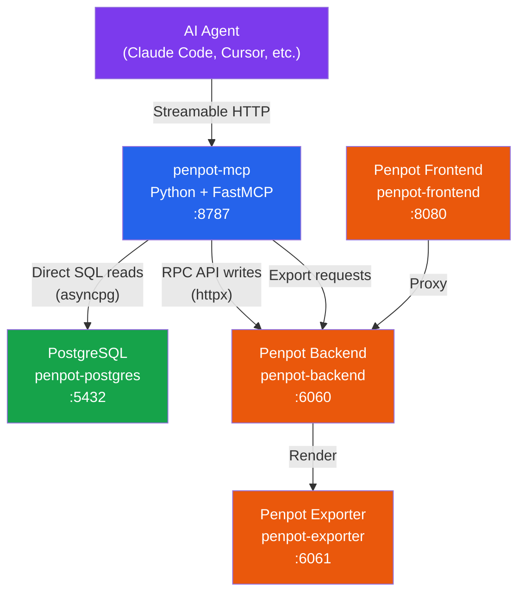

# Penpot MCP Server

**AI-powered design tool access for self-hosted Penpot via Model Context Protocol.**

[](LICENSE)
[](https://python.org)
[](https://modelcontextprotocol.io)
[](TOOLS.md)

---

## What is this?

An [MCP server](https://modelcontextprotocol.io) that gives AI agents (like Claude Code, Cursor, or any MCP-compatible client) **full programmatic access** to your self-hosted [Penpot](https://penpot.app) instance. AI can read, create, modify, and export design elements — from rectangles and text to full UI components — all through natural language.

Think of it as the bridge between your AI assistant and your design tool.

### Problems it solves

| Problem | Solution |
|---|---|
| **Manual design work** | AI creates UI components, layouts, and prototypes directly in Penpot |
| **No programmatic API for Penpot** | 66 tools covering projects, shapes, text, exports, comments, and more |
| **Design-to-code gap** | Generate CSS from any shape, export to SVG/PNG, extract design tokens |
| **Repetitive tasks** | Batch operations — rename shapes, update colors, create variants |
| **Design system maintenance** | Read/write components, colors, typographies programmatically |

---

## Architecture



**Dual-access strategy:**
- **Reads** go directly to PostgreSQL via `asyncpg` — fast and reliable
- **Writes** go through Penpot's RPC API via `httpx` — ensures proper change tracking and undo history
- **Exports** use Penpot's built-in exporter (headless Chromium) for pixel-perfect SVG/PNG output

---

## Tech Stack

| Component | Technology | Purpose |
|---|---|---|
| Language | Python 3.13 | Runtime |
| MCP SDK | [FastMCP](https://github.com/modelcontextprotocol/python-sdk) | Protocol handling, tool registration |
| Database | [asyncpg](https://github.com/MagicStack/asyncpg) | Direct PostgreSQL access |
| HTTP Client | [httpx](https://www.python-httpx.org/) | Penpot RPC API calls |
| Validation | [Pydantic v2](https://docs.pydantic.dev/) | Automatic parameter validation |
| Package Manager | [uv](https://github.com/astral-sh/uv) | Fast Python dependency management |
| Container | Docker | Deployment alongside Penpot |

---

## Quick Start

### Prerequisites

1. **Self-hosted Penpot** running via Docker Compose ([official guide](https://help.penpot.app/technical-guide/getting-started/#install-with-docker))
2. **Docker** and **Docker Compose** v2 installed
3. **Access tokens enabled** in your Penpot instance (see [Enable Access Tokens](#enable-access-tokens))

### Option A: Automated Setup

```bash
git clone https://github.com/ancrz/penpot-mcp-server.git
cd penpot-mcp-server
chmod +x setup.sh
./setup.sh
```

The script will guide you through configuration, build the Docker image, and start the server.

### Option B: Manual Setup

#### 1. Clone the repository

```bash
git clone https://github.com/ancrz/penpot-mcp-server.git
cd penpot-mcp-server
```

#### 2. Create your configuration

```bash
cp .env.example .env
```

Edit `.env` with your Penpot details:

```env
# Your Penpot access token (see "Enable Access Tokens" below)
PENPOT_ACCESS_TOKEN=your-token-here

# Your Penpot database password (from your Penpot docker-compose.yml)
PENPOT_DB_PASS=your-db-password

# Public URL where you access Penpot in the browser
PENPOT_PUBLIC_URL=http://localhost:9001
```

#### 3. Add the MCP service to your Penpot Docker stack

Add the `penpot-mcp` service definition to your existing Penpot `docker-compose.yml`. See [`docker-compose.penpot.yml`](docker-compose.penpot.yml) for the complete service definition to copy.

#### 4. Build and start

```bash
docker compose up -d --build penpot-mcp
```

#### 5. Verify it's running

```bash
curl -s http://localhost:8787/mcp \
  -H "Content-Type: application/json" \
  -d '{"jsonrpc":"2.0","id":1,"method":"initialize","params":{"protocolVersion":"2025-03-26","capabilities":{},"clientInfo":{"name":"test","version":"1.0"}}}'
```

You should see a JSON response with the server capabilities.

---

## Connect Your AI Agent

Penpot MCP uses **network transport** (streamable HTTP) — the server runs as a Docker container and clients connect via HTTP. This means:

- The server is **always running** independently (via Docker Compose)
- The client only needs the URL to connect — no process spawning
- **`env` in the client's JSON config is irrelevant** — credentials live in the server's own `.env` file (configured during [setup](#quick-start))
- Any client on the same machine (or network) can connect to `http://localhost:8787/mcp`

> **Key difference from stdio servers:** With stdio servers (like Skill Swarm), the client launches the process and injects env vars. With network servers like Penpot MCP, the server manages its own credentials. The `env` block in your client's MCP config has no effect.

---

### Claude Code

Claude Code uses `"type": "http"` for streamable HTTP connections.

**Global** (`~/.claude.json`):

```json
{
  "mcpServers": {
    "penpot": {
      "type": "http",
      "url": "http://localhost:8787/mcp"
    }
  }
}
```

**Project-level** (`.mcp.json` in your project root):

```json
{
  "mcpServers": {
    "penpot": {
      "type": "http",
      "url": "http://localhost:8787/mcp"
    }
  }
}
```

Restart Claude Code. You should see **66 tools** from the `penpot` server listed when you run `/mcp`.

> **Note:** Use `"type": "http"`, not `"streamable-http"`. Claude Code maps `http` to the streamable HTTP transport internally. Using `streamable-http` will cause a schema validation error.

---

### Gemini CLI

Gemini CLI uses `httpUrl` (not `url`) for streamable HTTP connections. Transport is inferred from the field name.

**Config file:** `~/.gemini/settings.json`

```json
{
  "mcpServers": {
    "penpot": {
      "httpUrl": "http://localhost:8787/mcp"
    }
  }
}
```

> **Note:** Gemini CLI distinguishes between `url` (SSE transport) and `httpUrl` (streamable HTTP transport). Penpot MCP uses streamable HTTP, so use `httpUrl`. No `type` field needed.

---

### Antigravity

Antigravity uses `serverUrl` for HTTP-based MCP servers.

**Config file:** `~/.gemini/antigravity/mcp_config.json`

```json
{
  "mcpServers": {
    "penpot": {
      "serverUrl": "http://localhost:8787/mcp"
    }
  }
}
```

> **Note:** Antigravity uses `serverUrl` (not `url` or `httpUrl`). If Antigravity runs inside Docker, make sure it can reach `localhost:8787` on the host — you may need `host.docker.internal:8787` instead of `localhost:8787` depending on your Docker network setup.

---

### Quick Comparison

| | Claude Code | Gemini CLI | Antigravity |
|---|---|---|---|
| **Config file** | `~/.claude.json` or `.mcp.json` | `~/.gemini/settings.json` | `~/.gemini/antigravity/mcp_config.json` |
| **URL field** | `"url"` | `"httpUrl"` | `"serverUrl"` |
| **Type field** | `"type": "http"` (required) | Not needed (inferred) | Not needed (inferred) |
| **`env` in JSON** | No effect (network server) | No effect (network server) | No effect (network server) |
| **Credentials** | Server's `.env` file | Server's `.env` file | Server's `.env` file |
| **Docker networking** | `localhost:8787` | `localhost:8787` | May need `host.docker.internal:8787` |

---

### Example prompts

Once connected, you can ask your AI agent things like:

- *"List my Penpot projects"*
- *"Create a login form with email/password fields and a submit button"*
- *"Export the Login Card frame as SVG"*
- *"What colors are defined in the design system?"*
- *"Add a comment at position (100, 200) saying 'Review this layout'"*

---

## Tools Overview

The server provides **66 tools** across 11 categories. See [**TOOLS.md**](TOOLS.md) for the complete reference with all parameters.

| Category | Count | Examples |
|---|---|---|
| Projects & Teams | 4 | `list_projects`, `list_teams`, `list_files`, `search_files` |
| File Operations | 9 | `create_file`, `get_file_pages`, `rename_file`, `duplicate_file` |
| Shape Reading | 6 | `get_shape_tree`, `get_shape_details`, `get_shape_css`, `search_shapes` |
| Components & Tokens | 4 | `get_design_tokens`, `get_colors_library`, `get_typography_library` |
| Comments | 6 | `create_comment`, `reply_to_comment`, `resolve_comment` |
| Media & Fonts | 3 | `upload_media`, `list_media_assets`, `list_fonts` |
| Database & Advanced | 3 | `query_database`, `get_webhooks`, `get_profile` |
| Snapshots | 2 | `create_snapshot`, `get_snapshots` |
| Export | 2 | `export_frame_png`, `export_frame_svg` |
| Shape Creation | 8 | `create_rectangle`, `create_frame`, `create_text`, `create_path` |
| Shape Modification | 12 | `set_fill`, `set_stroke`, `set_layout`, `move_shape`, `resize_shape` |
| Text Operations | 5 | `set_text_content`, `set_font`, `set_font_size`, `set_text_align` |
| Advanced Analysis | 2 | `get_file_raw_data`, `compare_revisions` |

---

## Configuration Reference

All settings are via environment variables. See [`.env.example`](.env.example) for a template.

| Variable | Default | Description |
|---|---|---|
| `PENPOT_BASE_URL` | `http://penpot-frontend:8080` | Internal Penpot URL (Docker network) |
| `PENPOT_PUBLIC_URL` | `http://localhost:9001` | Public URL where you access Penpot in browser |
| `PENPOT_ACCESS_TOKEN` | — | API access token (preferred auth method) |
| `PENPOT_EMAIL` | — | Penpot login email (fallback auth) |
| `PENPOT_PASSWORD` | — | Penpot login password (fallback auth) |
| `PENPOT_DB_HOST` | `penpot-postgres` | PostgreSQL host |
| `PENPOT_DB_PORT` | `5432` | PostgreSQL port |
| `PENPOT_DB_NAME` | `penpot` | Database name |
| `PENPOT_DB_USER` | `penpot` | Database user |
| `PENPOT_DB_PASS` | — | Database password |
| `MCP_HOST` | `0.0.0.0` | MCP server bind address |
| `MCP_PORT` | `8787` | MCP server port |
| `MCP_LOG_LEVEL` | `info` | Log level (debug/info/warning/error) |

---

## Enable Access Tokens

Penpot requires a feature flag to enable API access tokens.

### 1. Update your Penpot `.env` file

Add `enable-access-tokens` to your `PENPOT_FLAGS`:

```env
PENPOT_FLAGS=enable-login-with-password enable-registration enable-access-tokens
```

### 2. Restart Penpot

```bash
docker compose restart penpot-backend penpot-frontend
```

### 3. Create a token

1. Open Penpot in your browser
2. Click your avatar (bottom-left) → **Access Tokens**
3. Click **"Generate new token"**
4. Give it a name (e.g., "MCP Server")
5. Copy the token and paste it into your `.env` as `PENPOT_ACCESS_TOKEN`

---

## Penpot Docker Integration

The MCP server runs as a Docker container alongside your existing Penpot stack. You need to add it to your Penpot `docker-compose.yml`.

See [`docker-compose.penpot.yml`](docker-compose.penpot.yml) for the exact service definition to add. The key points:

- It connects to the `penpot` Docker network (same as other Penpot services)
- It depends on `penpot-postgres` (with health check) and `penpot-backend`
- It exposes port `8787` on localhost only (`127.0.0.1:8787:8787`)
- Environment variables reference Docker internal hostnames

---

## Development

### Running locally (outside Docker)

```bash
# Install uv if needed
curl -LsSf https://astral.sh/uv/install.sh | sh

# Install dependencies
uv sync

# Run the server (needs .env configured for local access)
uv run penpot-mcp
```

For local development, point `PENPOT_DB_HOST` and `PENPOT_DB_PORT` to your host-mapped PostgreSQL port, and `PENPOT_BASE_URL` to `http://localhost:9001`.

### Running tests

```bash
uv sync --group dev
uv run pytest tests/ -v
```

### Project structure

```
penpot-mcp-server/
├── src/penpot_mcp/
│   ├── server.py            # FastMCP entry point, 66 tool registrations
│   ├── config.py            # Pydantic Settings configuration
│   ├── services/
│   │   ├── db.py            # asyncpg connection pool
│   │   ├── api.py           # httpx RPC API client
│   │   ├── changes.py       # Penpot change operations builder
│   │   └── transit.py       # Transit+JSON decoder
│   ├── tools/
│   │   ├── projects.py      # Team & project queries
│   │   ├── files.py         # File CRUD operations
│   │   ├── shapes.py        # Shape reading & search
│   │   ├── create.py        # Shape creation
│   │   ├── modify.py        # Shape modification
│   │   ├── text.py          # Text operations
│   │   ├── export.py        # PNG/SVG export
│   │   ├── components.py    # Components & design tokens
│   │   ├── comments.py      # Comments & collaboration
│   │   ├── media.py         # Media assets & fonts
│   │   ├── database.py      # Raw SQL queries
│   │   └── advanced.py      # File raw data & revision comparison
│   └── transformers/
│       ├── css.py           # Shape → CSS conversion
│       ├── svg.py           # Shape → SVG conversion
│       └── layout.py        # Layout → CSS flexbox/grid
├── tests/
│   ├── conftest.py
│   ├── test_projects.py
│   ├── test_files.py
│   ├── test_shapes.py
│   └── test_e2e_login_form.py
├── pyproject.toml
├── Dockerfile
├── .env.example
├── setup.sh
├── docker-compose.penpot.yml
├── TOOLS.md
└── LICENSE
```

---

## License

This project is licensed under the [Apache License 2.0](LICENSE).

---

## Acknowledgments

- [Penpot](https://penpot.app) — The open-source design platform
- [Model Context Protocol](https://modelcontextprotocol.io) — The protocol standard
- [FastMCP](https://github.com/modelcontextprotocol/python-sdk) — Python MCP SDK

<div align="center">

[⬆ Back to Top](#penpot-mcp-server)

</div>
